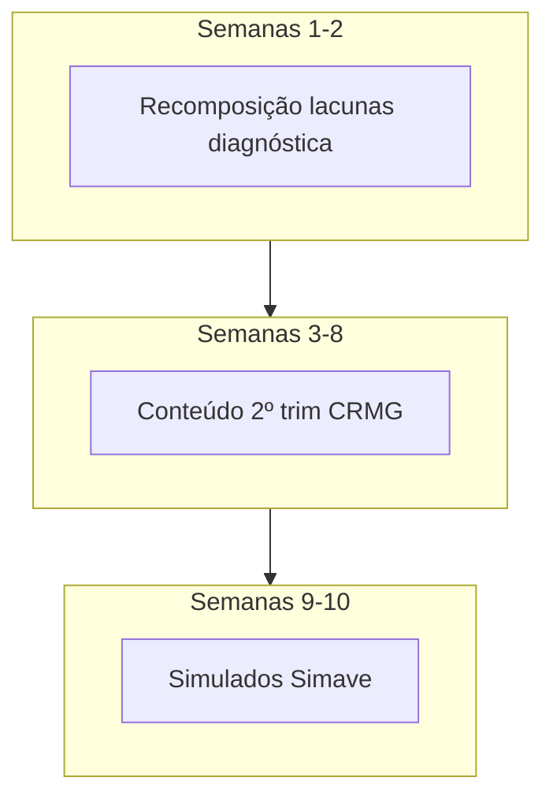

# Plano Macro — 2º Trimestre 2026 | Preparação para 2ª Avaliação Trimestral

## Situação atual (junho/2026)

| Evento | Status |
|--------|--------|
| Avaliação Diagnóstica 2026 | Aplicada (fev); resultados mar/2026 |
| 1ª Avaliação Trimestral | Aplicada **25/05–03/06/2026** |
| 2º trimestre letivo | **Em andamento** |
| 2ª Avaliação Trimestral | **Prevista no 2º semestre** (confirmar no portal SEE) |

## Estratégia geral (três séries)

## Metas por série até a 2ª trimestral

| Série | Meta mínima | Simulado quinzenal |
|-------|-------------|-------------------|
| 1º | 70% da turma domina afim + início quadrática/vértice | 10 questões |
| 2º | 70% domina trig no triângulo retângulo + gráficos básicos seno/cosseno | 10 questões |
| 3º | 70% domina distância, reta e circunferência | 10 questões |

## Calendário tipo (ajustar à escola)

Assumindo **2 aulas de matemática por semana** (100 min/semana):

| Semanas do 2º trim | 1º ano | 2º ano | 3º ano |
|--------------------|--------|--------|--------|
| 1–2 | Recomposição função + plano cartesiano | Pitágoras + triângulo retângulo | Distância e ponto médio |
| 3–4 | Função afim profunda | Razões trig | Equação da reta |
| 5–6 | Quadrática e vértice | Seno/cosseno e gráficos | Circunferência |
| 7–8 | Contagem/probabilidade | Função por partes + polígonos | PA/PG + revisão |
| 9–10 | Simulados | Simulados | Simulados |

## Roteiro de simulado (50 min de aplicação em aula)

1. 8 questões objetivas (4 fácil, 3 médio, 1 difícil)
2. 1 questão de justificativa oral (opcional, + recuperação)
3. Correção coletiva na aula seguinte (primeiros 15 min)
4. Lista de exercícios personalizada para quem errou ≥ 4 itens

## Ação imediata pós-1ª trimestral

1. Exportar painel Simave por turma (se disponível na escola).
2. Preencher planilha:

| Estudante | Habilidade fraca | Ação |
|-----------|------------------|------|
| ... | ... | Reforço em dupla / atividade Aprender Já |

3. Comunicar coordenação sobre **2 aulas/semana de recomposição** até a 2ª trimestral.
4. Pedir ao agente: `@professor-matematica-mg plano da semana X para 2º ano`.

## Pedidos úteis ao agente

- `Monte 4 planos de 50 min para vértice da parábola (1º ano, turma com 35% de acerto em função).`
- `Crie simulado estilo Simave: 2 blocos equalização + 8 principal (trigonometria, 2º ano).`
- `Sugira atividade rural para distância entre pontos (3º ano).`
- `Analisei que a turma errou proporcionalidade — sequência de 3 aulas de recomposição.`
